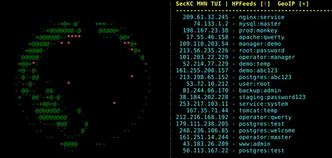

# SecKC-MHN-Globe

Inspired by [The SecKC MHN Cyber Attack Map](https://mhn.h-i-r.net/dash), I wanted something similar to run in text mode. Minimum recommended terminal size is 80x24. UI elements will scale nicely to higher terminal sizes and on-the-fly window size changes are handled gracefully above the minimum recommended size.

## TUI Earth Visualization with Honeypot Monitoring


Terminal-based application displaying a rotating 3D ASCII globe with a live dashboard of incoming connection attempts. Connects to HPFeeds (honeypot data feeds) to show real-time attack data from security honeypots worldwide.


## Features

### Visual Enhancements
- **Multiple Character Sets**: Choose between ASCII, Unicode blocks, or high-res Braille rendering (2-4x higher resolution)
- **7 Color Themes**: default, matrix, amber, solarized, nord, dracula, mono - switch live with `T` key
- **Globe Lighting & Shading**: Lambertian diffuse lighting with configurable sun position and auto-follow mode
- **Attack Arc Trails**: Bézier curve attack paths with fade effects and motion blur
- **Matrix Rain Effect**: Falling code columns with configurable density
- **CRT/Scanline Effects**: Retro phosphor glow and scanline dimming
- **Protocol Glyphs**: Visual icons showing attack types (# SSH, ~ Telnet, @ SMTP, : HTTP, % FTP)

### Real-time Data
- **Live Attack Visualization**: Attacks marked on globe with protocol-specific indicators
- **HPFeeds Integration**: Connect to honeypot data feeds for real-time threat intelligence
- **IP/Username/Password Display**: Shows credential attempts from detected logins
- **Geographic Mapping**: IP geolocation with MaxMind GeoLite2 database (LRU cached)
- **Hourly Attack Stats**: ASCII bar chart + sparklines showing 24-hour attack volume
- **Demo Storm Mode**: Simulated attack traffic generator for presentations

### Interactive Controls
- **Navigation**: Arrow keys to nudge view, `+`/`-` to zoom (0.5x-3.0x)
- **Playback**: `Space` to pause, `[`/`]` to adjust spin speed (0.1x-5.0x)
- **Visual Toggles**: `T` cycle themes, `L` toggle lighting, `G` toggle arcs, `R` toggle rain
- **Help Overlay**: Press `?` for keyboard shortcuts
- **Responsive Design**: Adapts to terminal size with optimized layout

### Configuration & Recording
- **TOML Config Files**: Load settings from config file with CLI override support
- **Asciinema Recording**: Export sessions to shareable `.cast` files
- **Debug Logging**: Comprehensive logging for troubleshooting and analysis
- **Mock Data Fallback**: Generates simulated data when HPFeeds is unavailable
## Build

```bash
# Clone the repository
git clone https://github.com/n0xa/SecKC-MHN-Globe.git
cd SecKC-MHN-Globe

# Install dependencies
go mod tidy

# Build the enhanced version
go build SecKC-MHN-Globe-Enhanced.go

# Or build the original version
go build SecKC-MHN-Globe.go
```

## Quick Start

### Basic Usage (with demo mode)
```bash
# Run with simulated attack traffic
./SecKC-MHN-Globe-Enhanced --demo-storm

# Matrix theme with all effects
./SecKC-MHN-Globe-Enhanced --theme matrix --charset braille --rain --arcs curved --lighting --demo-storm

# Minimal setup for live data
./SecKC-MHN-Globe-Enhanced
```

### Interactive Controls

**Navigation & Playback:**
- `Space` - Pause/resume globe rotation
- `[` / `]` - Decrease/increase spin speed
- `+` / `-` - Zoom in/out
- Arrow keys - Nudge globe view angle

**Visual Toggles:**
- `T` - Cycle through 7 color themes
- `L` - Toggle globe lighting/shading
- `G` - Toggle attack arc trails
- `R` - Toggle Matrix rain effect
- `?` - Show/hide help overlay

**Exit:**
- `Q`, `X`, `Esc`, or `Ctrl+C` - Quit application

## Command Line Options

### Visual Options
- `--charset <type>` - Character set: ascii|blocks|braille (default: ascii)
- `--theme <name>` - Theme: default|matrix|amber|solarized|nord|dracula|mono
- `--arcs <style>` - Attack arcs: curved|straight|off (default: off)
- `--trail-ms <n>` - Arc trail duration in milliseconds (default: 1200)
- `--lighting` - Enable globe lighting/shading
- `--light-lon <deg>` - Light source longitude (default: 0.0)
- `--light-lat <deg>` - Light source latitude (default: 0.0)
- `--light-follow` - Light rotates opposite to globe
- `--rain` - Enable Matrix rain effect
- `--rain-density <n>` - Rain density 0-10 (default: 5)
- `--crt` - Enable CRT scanline effect
- `--glow <n>` - Phosphor glow level 0-3 (default: 0)
- `--protocol-glyphs` - Show protocol-specific icons on attacks

### Display Options
- `-s <seconds>` - Globe rotation period (10-300, default: 30)
- `-r <milliseconds>` - Refresh rate (50-1000, default: 100)
- `-a <ratio>` - Character aspect ratio (1.0-4.0, default: 2.0)

### Data & API Options
- `-u <url>` - SecKC API base URL (default: https://mhn.h-i-r.net/seckcapi)
- `-e <count>` - Max events per API call (1-500, default: 50)
- `-p <duration>` - API polling interval (1s-300s, default: 2s)
- `--demo-storm` - Enable demo traffic generator
- `--demo-rate <n>` - Demo attacks per second (default: 10)

### Configuration & Recording
- `--config <file>` - Load settings from TOML config file
- `--record <file>` - Record session to asciinema file
- `-d <filename>` - Enable debug logging

### Examples

```bash
# High-resolution Braille rendering with demo traffic
./SecKC-MHN-Globe-Enhanced --charset braille --demo-storm

# Full visual effects showcase
./SecKC-MHN-Globe-Enhanced --theme matrix --charset braille --rain --arcs curved --lighting --light-follow --protocol-glyphs --demo-storm --demo-rate 50

# Conference presentation mode with recording
./SecKC-MHN-Globe-Enhanced --theme dracula --arcs curved --demo-storm --demo-rate 100 --record conference-demo.cast

# Live monitoring with custom theme
./SecKC-MHN-Globe-Enhanced --theme nord --arcs curved --lighting

# Original version (simple ASCII globe)
./SecKC-MHN-Globe
```

## TOML Configuration File

You can save your preferred settings in a config file (e.g., `~/.config/seckc-globe.toml`):

```toml
[api]
base_url = "https://mhn.h-i-r.net/seckcapi"
poll_interval = "2s"
max_events = 50

[display]
theme = "matrix"
charset = "braille"
rotation_period = 30
refresh_rate = 100
aspect_ratio = 2.0

[effects]
arc_style = "curved"
trail_ms = 1200
rain_enabled = true
rain_density = 5
lighting_enabled = true
light_follow = true
protocol_glyphs = true
```

Load with: `./SecKC-MHN-Globe-Enhanced --config ~/.config/seckc-globe.toml`

**Note:** This program interfaces with the Public SecKC MHN Dashboard by default when no configuration is provided.

## Dependencies

```go
require (
    github.com/gdamore/tcell/v2 v2.8.1      // Terminal UI
    github.com/BurntSushi/toml v1.4.0       // TOML config parser
)
```

## License

This project is licensed under the BSD 2-Clause License - see the [LICENSE](LICENSE) file for details.

## Troubleshooting

### Common Issues

3. **Terminal display issues**: Ensure terminal supports color and proper size
4. **Performance problems**: Enable debug logging with `-d` option
5. **Globe landmass seems "blocky"**: Reduce terminal size to below 190x70

### Debug Mode

Enable debug logging:
```bash
./SecKC-MHN-Globe -d debug.log
```

This logs:
- Screen updates and rendering
- HPFeeds message processing
- GeoIP lookup results
- Dashboard updates
