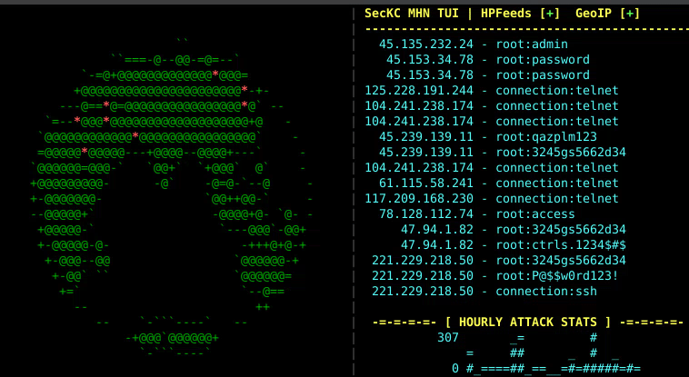

# SecKC-MHN-Globe

Inspired by [The SecKC MHN Cyber Attack Map](https://mhn.h-i-r.net/dash), I wanted something similar to run in text mode. Minimum recommended terminal size is 80x24. UI elements will scale nicely to higher terminal sizes and on-the-fly window size changes are handled gracefully above the minimum recommended size.

## TUI Earth Visualization with Honeypot Monitoring


Terminal-based application displaying a rotating 3D ASCII globe with a live dashboard of incoming connection attempts. Connects to HPFeeds (honeypot data feeds) to show real-time attack data from security honeypots worldwide. 


## Features

- **3D ASCII Globe**: Rotating Earth visualization in your terminal
- **Live Attack Visualization**: Red asterisks mark (approximate) attack source locations on the globe
- **HPFeeds Integration**: Connect to honeypot data feeds for real-time threat intelligence
- **IP/Username/Password**: If a login is detected from an IP, the username and password is displayed
- **SSH/Telnet Probes**: Connection attempts without login are displayed as connection:[ssh|telnet]
- **Geographic Mapping**: IP geolocation with MaxMind GeoLite2 database
- **Mock Data Fallback**: Generates simulated data when HPFeeds is unavailable
- **Responsive Design**: Adapts to terminal size with optimized layout
- **Debug Logging**: Comprehensive logging for troubleshooting and analysis
- **Status Indicators**: + or ! indicates whether HPFeeds and GeoIP are properly configured and working
- **Configurable Refresh Rate**: Faster refresh for smoother animation, slower for low bandwidth (serial terminals, etc)  
- **Monochrome Mode**: For terminals that have reduced color support  
- **Hourly Attack Stats**: An ASCII bar chart shows SecKC MHN attack volume for the past 24 hours
## Build

```bash
# Clone the repository
git clone https://github.com/n0xa/SecKC-MHN-Globe.git
cd SecKC-MHN-Globe

# Build the application
go build SecKC-MHN-Globe.go

# Run with default settings (mock attack data, no attack coordinates)
./SecKC-MHN-Globe
```

## Usage

```bash
SecKC-MHN-Globe [OPTIONS]
```

### Command Line Options

 `-h`  Show help message   
 `-d <filename>`  Enable debug logging to specified file   
 `-s <seconds>`  Globe rotation period in seconds (10-300, default: 30)   
 `-r <milliseconds>` Globe refresh rate in ms (50-1000, default: 100)  
 `-m`  Monochrome mode without fancy colors  
 `-a <ratio>`  Character aspect ratio (height/width, 1.0-4.0, default: 2.0)  
 `-u <url>`  Base URL for SecKC API (default: https://mhn.h-i-r.net/seckcapi)  
 `-e <count>`  Maximum events to fetch per API call (1-500, default: 50)  
 `-p <duration>`  API polling interval (1s-300s, default: 2s)  

### Controls

Press `Q`, `X`, `Space`, `Esc` or `Ctrl+C` to exit

### Examples

```bash
# Default 30-second rotation
./SecKC-MHN-Globe

# Slower 60-second rotation
./SecKC-MHN-Globe -s 60

# Fast rotation with debug logging
./SecKC-MHN-Globe -s 10 -d debug.log
```

## Configuration

**Example:**
This program was made to interface with the Public SecKC MHN Dashboard that I maintain, which this project will try to use by default if no configuration is provided.

## Dependencies

```go
require (
    github.com/gdamore/tcell/v2 v2.8.1      // Terminal UI
)
```

## License

This project is licensed under the BSD 2-Clause License - see the [LICENSE](LICENSE) file for details.

## Troubleshooting

### Common Issues

3. **Terminal display issues**: Ensure terminal supports color and proper size
4. **Performance problems**: Enable debug logging with `-d` option
5. **Globe landmass seems "blocky"**: Reduce terminal size to below 190x70

### Debug Mode

Enable debug logging:
```bash
./SecKC-MHN-Globe -d debug.log
```

This logs:
- Screen updates and rendering
- HPFeeds message processing
- GeoIP lookup results
- Dashboard updates
